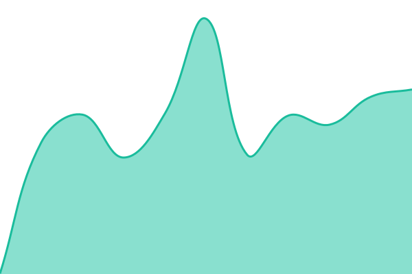
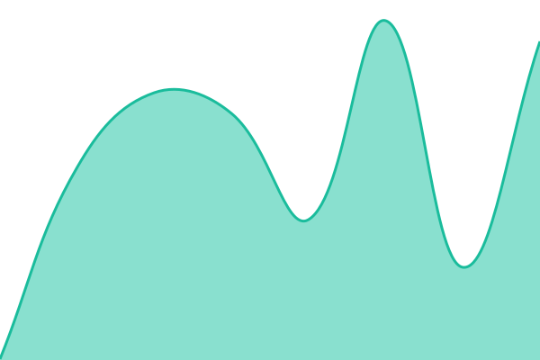

# [📈 Live Status](https://status.brixa.ai): <!--live status--> **🟩 All systems operational**

This repository contains the open-source uptime monitor and status page for [Brixa AI](brixa.ai), powered by [Upptime](https://github.com/upptime/upptime).

With [Upptime](https://upptime.js.org), you can get your own unlimited and free uptime monitor and status page, powered entirely by a GitHub repository. We use [Issues](https://github.com/brixa-ai/status/issues) as incident reports, [Actions](https://github.com/brixa-ai/status/actions) as uptime monitors, and [Pages](https://status.brixa.ai) for the status page.

<!--start: status pages-->
<!-- This summary is generated by Upptime (https://github.com/upptime/upptime) -->
<!-- Do not edit this manually, your changes will be overwritten -->
<!-- prettier-ignore -->
| URL | Status | History | Response Time | Uptime |
| --- | ------ | ------- | ------------- | ------ |
|  [Web App](https://app.brixa.ai/) | 🟩 Up | [web-app.yml](https://github.com/brixa-ai/status/commits/HEAD/history/web-app.yml) | 

 120ms
     
 | 

<a href="https://status.brixa.ai/history/web-app">100.00%</a>
    

|  [Backend API](https://back.brixa.ai/api/hotels) | 🟩 Up | [backend-api.yml](https://github.com/brixa-ai/status/commits/HEAD/history/backend-api.yml) | 

 333ms
     
 | 

<a href="https://status.brixa.ai/history/backend-api">100.00%</a>
    

|  [Channels / Webhooks](https://channels.brixa.ai/health) | 🟩 Up | [channels-webhooks.yml](https://github.com/brixa-ai/status/commits/HEAD/history/channels-webhooks.yml) | 

 286ms
     
 | 

<a href="https://status.brixa.ai/history/channels-webhooks">100.00%</a>
    

<!--end: status pages-->

[**Visit our status website →**](https://status.brixa.ai)

## 📄 License

- Powered by: [Upptime](https://github.com/upptime/upptime)
- Code: [MIT](./LICENSE) © [Anand Chowdhary](https://anandchowdhary.com)
- Data in the `./history` directory: [Open Database License](https://opendatacommons.org/licenses/odbl/1-0/)
